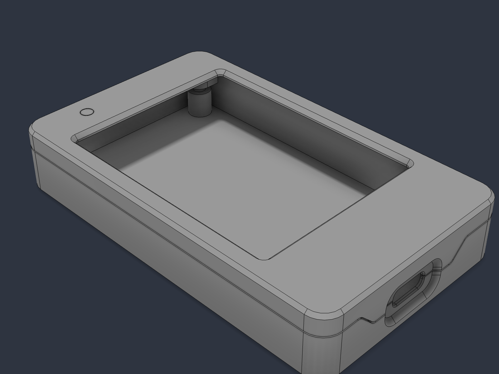
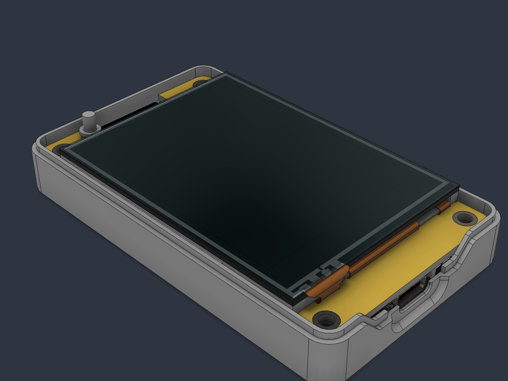
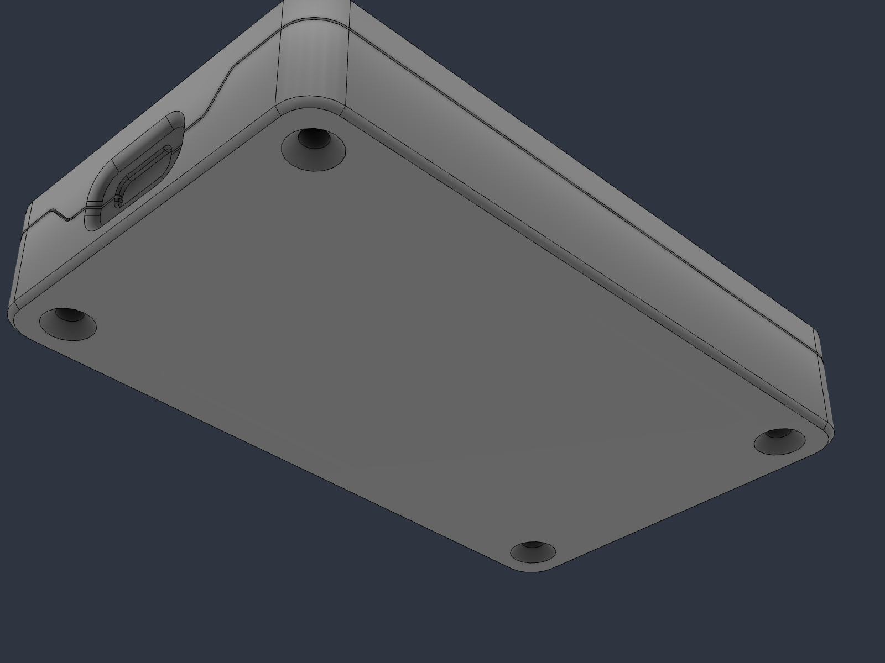

# Case — split PETG housing for the CYD (USB-C variant)

Three printed parts, four screws, four inserts. The step-by-step build (buying the board, inserts, assembly, with pictures) is in [`../docs/BUILD.md`](../docs/BUILD.md); the parts list as a spreadsheet is [`BOM.csv`](BOM.csv). Only the USB-C port is exposed; the light sensor gets a
clear light pipe so the firmware's ambient-light features still work behind a closed lid. Designed in
Fusion 360 by WOODWERD LLC; STL for printing, STEP if you want to modify it. This is housing **v2** — printed, test-fitted on a USB-C board, and the released design.

| File | Part | Qty | Print |
|---|---|---|---|
| `CYD_FlowCtrl_Base.stl` | Base — board drops in USB-C end first, screws from below | 1 | open side **up**, no supports |
| `CYD_FlowCtrl_Lid.stl` | Lid — display window, insert bosses, USB-C tongue | 1 | face **down** on the bed, no supports |
| `CYD_FlowCtrl_LightPipe.stl` | Light pipe for the LDR — Ø2.9 rod on a Ø5 flange | 1 | **clear** filament, flange down, 100 % infill |

Outer size 54.6 × 90.6 × 16.1 mm. Wall 2.0 mm, 0.3 mm clearance per side around the board. Volumes:
base 15.2 cm³, lid 5.4 cm³.

## Print settings that matter
- **Material:** PETG recommended (heat-set inserts seat cleanly; PLA works at a lower iron temperature).
- **Layer height:** 0.2 mm (0.16 for a nicer display chamfer). 3–4 perimeters so the lip and groove are solid.
- **No supports** on any part. The USB-C funnel is a 45° loft and the port hole is bridged by the tongue.
- **Tolerances:** the lid rides on a 0.9 mm lip with 0.15 mm lateral clearance and a designed 0.3 mm
  parting-line gap outside. If your printer runs fat, a −0.1 mm horizontal expansion (XY compensation)
  on the lid is the first thing to try. If a USB-C cable won't click home, the local wall at the port
  is 0.8 mm — sand the lead-in chamfer before reprinting.
- **Test print first:** the base alone, and try a cable in it. That's the only fit that matters.

## Hardware (BOM)
| Qty | Part | Spec |
|---|---|---|
| 4 | M3 × 14 mm flat-head screw, 90° countersunk, hex socket | DIN 7991 / ISO 10642. Not M3 × 16 — the tip would reach the lid face. |
| 4 | M3 brass heat-set insert, **4 mm long**, OD 4.0–4.2 | The "M3 × L4" kit size (Voron M3×5×4 also fits). 5.7 mm inserts bottom out. |
| 1 | Cheap Yellow Display **USB-C / 2-USB** variant (ESP32-2432S028R with Type-C) | The micro-USB-only board also fits mechanically but its port is covered. |

Full fastener sheet with a section drawing: [`Fastener_Spec.pdf`](Fastener_Spec.pdf).

## Assembly
1. Heat-set the four inserts into the lid bosses — soldering iron with an M3 insert tip, ~230 °C for PETG
   (~200 °C for PLA), press to flush, let cool. Do this **before** the board goes in.
2. Push the light pipe up into its tube on the lid ceiling from inside, flange against the ceiling.
3. Flash the board first (it's easier with it out of the case), then drop it into the base, USB-C end first.
4. Lid on: tongue into the slot over the port, lip into the groove. Four screws from below, snug only — it's plastic.

## What's covered / open
- Exposed: USB-C, light sensor (via pipe), display, touch.
- Covered: micro-USB, microSD, RST/BOOT buttons, JST headers, RGB LED (it may show through light-coloured filament).
  A flip-down SD door is the obvious next feature if you need the card slot.

## Modifying
`*.step` files are exact geometry. All corner radii are concentric with the board's R2.5 corners
(centres at ±22.5, ±40.5 mm from the board centre); the split is at z 2.5 mm above the PCB underside.
