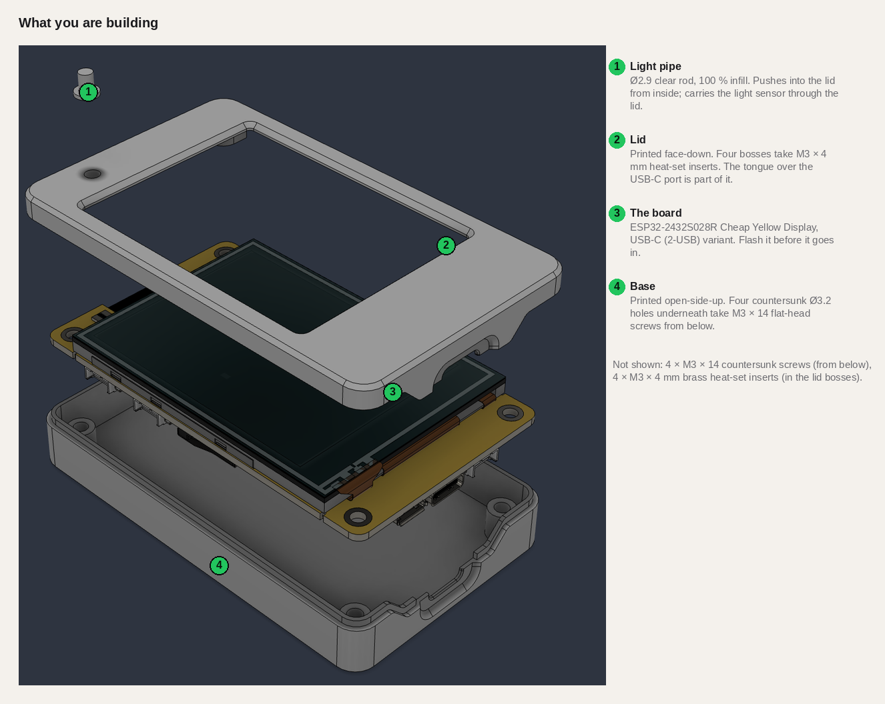
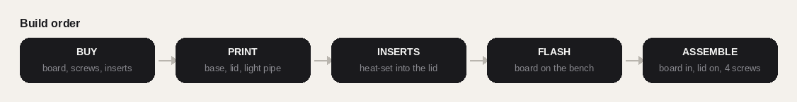
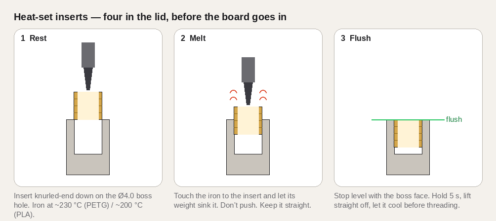
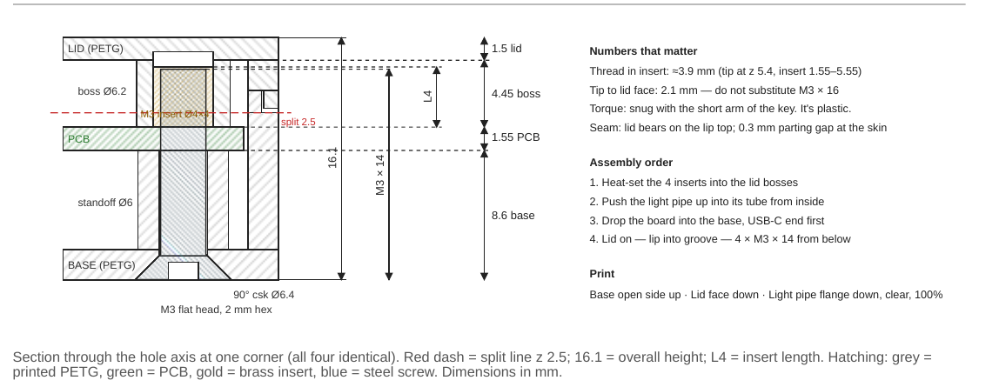

# Build it — parts, printing, inserts, assembly

Everything between "I'd like one" and "it's on my desk." Nothing here needs soldering beyond a
soldering iron used as a heat source for the inserts. Budget an evening: an hour of printing you
don't have to watch, twenty minutes at the bench.

## Bill of materials

| # | Qty | Part | Spec | Notes |
|---|---|---|---|---|
| 1 | 1 | **Cheap Yellow Display board** | ESP32-2432S028R, 2.8" 320 × 240 touch, **USB-C (2-USB) variant** | The case only exposes USB-C — buy the version that has a USB-C port |
| 2 | 1 | USB-C cable, data | USB-C → USB-A recommended | Some boards lack CC resistors; C-to-C into a Mac's C port may not power |
| 3 | 4 | **Flat-head screw** | **M3 × 14 mm**, 90° countersunk, hex socket, DIN 7991 / ISO 10642 | Length includes the head. Not M3 × 16. 2 mm hex key |
| 4 | 4 | **Heat-set threaded insert** | **M3, brass, 4 mm long, OD 4.0–4.2 mm** | The "M3 × L4" kit size; Voron M3×5×4 also fits. Not the 5.7 mm ones |
| 5 | 1 | Printed: **Base** | `CYD_FlowCtrl_Base.stl`, PETG, no supports | open side up |
| 6 | 1 | Printed: **Lid** | `CYD_FlowCtrl_Lid.stl`, PETG, no supports | face down |
| 7 | 1 | Printed: **Light pipe** | `CYD_FlowCtrl_LightPipe.stl`, **clear** filament, 100 % infill | flange down |
| — | — | Tools | soldering iron (insert tip or clean conical), 2 mm hex key, 3D printer | |

Same list as a spreadsheet: [`../case/BOM.csv`](../case/BOM.csv). Fastener detail with a section
drawing: [`../case/Fastener_Spec.pdf`](../case/Fastener_Spec.pdf).

## 1 · Buy

| Qty | Part | What to look for | Where |
|---|---|---|---|
| 1 | **ESP32-2432S028R "Cheap Yellow Display", USB-C variant** | 2.8" 320 × 240 touch display with an ESP32 on the back. Listings say *ESP32-2432S028R*, *CYD*, or *Cheap Yellow Display*. **Get the version with a USB-C port** (it has both micro-USB and USB-C on the board; the community calls it "CYD2USB" or "2-USB"). The case only exposes USB-C. | Amazon, AliExpress, Banggood — usually well under $20. Two-packs are common. |
| 1 | USB-C cable, data-capable | Any phone cable that syncs data works. Some CYD boards lack the CC resistors, so a **USB-C → USB-A** cable into an A port (or an A adapter) is the reliable choice; C-to-C into a Mac's C port sometimes gives no power. | you have one |
| 4 | **M3 × 14 mm flat-head screw**, 90° countersunk, hex socket | DIN 7991 / ISO 10642. Stainless or black oxide. Length **14** including the head — **not 16**, the tip would reach the lid face. 2 mm hex key. | any metric fastener kit or hardware store |
| 4 | **M3 brass heat-set insert, 4 mm long, OD 4.0–4.2 mm** | The "M3 × L4" size in most insert kits; Voron-style M3×5×4 also fits. **Not the 5.7 mm ones** — they bottom out in the boss. | insert kit, CNC Kitchen, Amazon |
| ~30 g | Filament, PETG recommended | Base and lid. PLA works (use a cooler iron for the inserts). | — |
| a scrap | **Clear** filament | For the light pipe. Transparent PETG or clear PLA. Natural/translucent works; opaque does not. | — |

**Tools:** a 3D printer (0.4 mm nozzle is fine) · a soldering iron, ideally with an M3 insert tip, a
clean conical tip will do · a 2 mm hex key · optional calipers for sorting screws.

**Is this screw M3?** Hold the bare board over the bin: the screw that drops through a corner hole is
M3 (Ø3.0 thread, 5.5–6 mm head). M4 and M5 won't pass. The fastener sheet has a sorting table:
[`../case/Fastener_Spec.pdf`](../case/Fastener_Spec.pdf).

## 2 · Print

Files in [`../case/`](../case/). STL for slicing, STEP if you want to change something.

| File | Orientation | Notes |
|---|---|---|
| `CYD_FlowCtrl_Base.stl` | **open side up** | no supports; the countersinks are on the bed side and print clean |
| `CYD_FlowCtrl_Lid.stl` | **face down** | no supports; the display chamfer is on the bed, the bosses point up |
| `CYD_FlowCtrl_LightPipe.stl` | **flange down** | clear filament, **100 % infill**, slow — it's a 5 mm part |

Settings that matter: 0.2 mm layers (0.16 for a nicer chamfer), 3–4 perimeters so the lip and groove
are solid, PETG at your usual temperature, no supports on anything. Outer size 54.6 × 90.6 × 16.1 mm.

**Print the base first and try a USB-C cable in it.** That's the only fit that matters. If the plug
won't click home, sand the lead-in chamfer a little; if your printer runs fat and the lid is tight on
the base, a −0.1 mm horizontal-expansion (XY compensation) on the lid is the first knob to turn.

## 3 · Inserts

Do this **before** the board goes anywhere near the lid.

1. Set the iron to ~230 °C for PETG (~200 °C for PLA).
2. Rest an insert, knurled end down, on one of the four Ø4.0 mm holes in the lid bosses.
3. Touch the iron to the insert and let the iron's weight press it in — don't push. Keep it straight.
4. Stop when the insert is **flush** with the boss face. Hold 5 seconds, lift straight off.
5. Let it cool before threading anything in. Repeat ×4.

If one goes in crooked, reheat and nudge it; the boss has room. This is where the insert and the screw
sit in the finished stack — the screw comes up from the base, through the board, and gets about
3.9 mm of thread in the insert:

## 4 · Flash the board on the bench

Easier out of the case: [`GETTING_STARTED.md`](GETTING_STARTED.md#1-set-up-once) has the two-line
flash. Confirm the screen comes up with "Pairing…" before you close anything up. If you hold BOOT while
plugging in, the port shows up on stubborn boards.

## 5 · Assemble

1. Push the **light pipe** up into its tube on the underside of the lid, flange against the ceiling.
2. Drop the **board** into the base, **USB-C end first**, so the port seats in the lower half of its
   opening. Screen up. The four corner holes line up over the standoffs.
3. **Lid on**: the tongue over the port goes into its slot, then the lip drops into the groove all the
   way round. It should seat with no force; if it doesn't, something's under it.
4. Flip it over and drive the **four M3 × 14 screws** from below, 2 mm hex, snug with the short arm
   of the key. It's plastic — stop when the head sits in the countersink.

## 6 · Then

Pair it and set the one Wispr shortcut — [`GETTING_STARTED.md`](GETTING_STARTED.md). The light
sensor works through the pipe if you ever enable dimming; the RGB LED may show faintly through
lighter filament.

## What's covered on purpose
Micro-USB, the microSD slot, the RST/BOOT buttons and the JST headers are all inside. A flip-down SD
door is the obvious next feature if you need the card; the STEP files make that a small edit.
