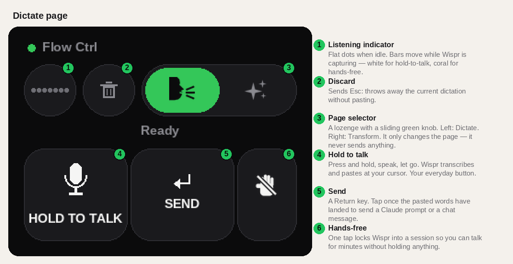
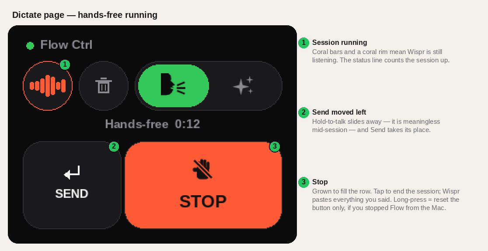
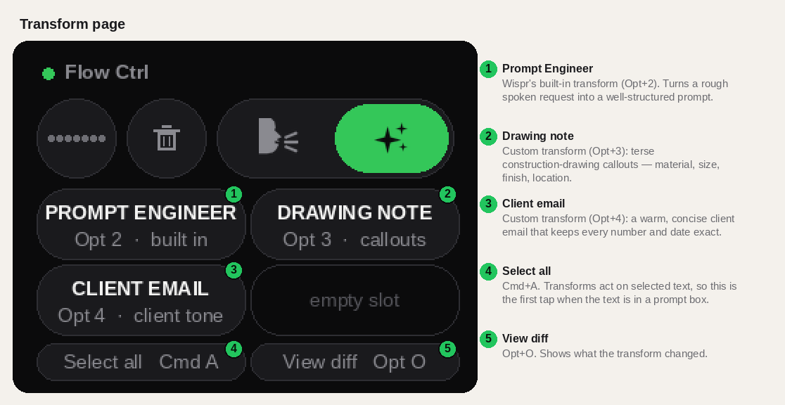
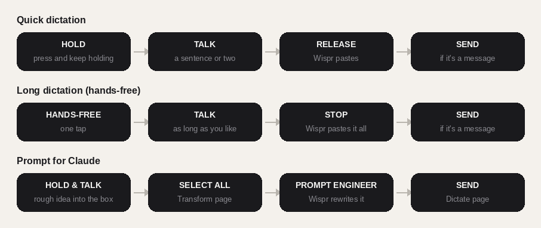

# Getting started with Flow Ctrl

Flow Ctrl is a desk button for [Wispr Flow](https://wisprflow.ai) dictation. It is a Cheap Yellow Display
(an ESP32 with a 2.8" touchscreen) in a printed case that pairs with your Mac as a Bluetooth keyboard.
Every button on it just sends a keyboard shortcut Wispr already understands — so there is nothing to
install on the Mac, and if you unplug it, nothing changes.

This guide assumes the puck is built. If you are starting from parts, [BUILD.md](BUILD.md) comes first —
board, printing, inserts, screws. This is the ten-minute version of what follows: what to set up once,
then what each button is for.

## 1 · Set up once

**Flash the firmware.** Plug the board in over USB-C and either use the web flasher in Chrome
([esptool-js](https://espressif.github.io/esptool-js/): 460800 baud, address `0x0`,
file `release/flow-ctrl-v0.9-cyd2usb.bin`) or, from a terminal:

```
pip install esptool
esptool.py --chip esp32 --port /dev/cu.usbserial-XXXX --baud 460800 write_flash 0x0 flow-ctrl-v0.9-cyd2usb.bin
```

The screen comes up with an amber dot and "Pairing…".

**Pair it.** System Settings → Bluetooth → **Flow Ctrl** → Connect. The dot turns green, the title
reads "Flow Ctrl", and the buttons wake up. The Mac remembers it; from now on it reconnects on its own
whenever the board is powered.

**Point Wispr at it.** Wispr Flow → Settings → General → Shortcuts → *Push to talk* → press
**Ctrl + Opt + T**. That is the only setting Flow Ctrl needs. (If you would rather keep a different
chord, the firmware's chord is a build flag — see the README.)

**Optional — Transforms.** If you want the second page, Wispr Flow → Settings → Transforms → create
two custom transforms and give them the shortcuts **Opt + 3** and **Opt + 4**. Suggested prompts are
in the README. Prompt Engineer is built in and needs nothing.

Then put it where your hand rests when you are not typing. It is always on, always full brightness,
and never sleeps — a button you have to wake up first is not a button.

## 2 · The Dictate page



This is the page it wakes up on and the one you will live on.

1. **Listening indicator.** The circle shows what Wispr is doing. Flat dots: idle. White bars: you are
   holding to talk. Coral bars: a hands-free session is running. It is on both pages, so you can
   never lose track of an open session.
2. **Discard.** Sends `Esc`. Wispr throws away whatever it is currently transcribing and pastes
   nothing. Use it when you said the wrong thing.
3. **Page selector.** A lozenge with a green knob that slides between two icons — the talking head
   (Dictate) and the sparkles (Transform). It only changes what the screen shows. It never sends a key.
4. **Hold to talk.** The everyday button. Press and keep your finger down, say a sentence or two, let
   go. Wispr transcribes and pastes at wherever your cursor is. Feels like a walkie-talkie.
5. **Send.** A Return key. When you dictate into a chat box or a Claude prompt, tap this once the
   words have appeared and it goes. It is a separate key on purpose: Wispr pastes a beat *after*
   you let go, and a Return fired too early would send an empty message.
6. **Hands-free.** The slashed-hand key. One tap starts a session that runs until you stop it — for
   long dictation where holding a button for three minutes would be silly.

## 3 · Hands-free, while it runs



Tap the hand and the row re-arranges itself. Hold-to-talk slides off the screen (it is meaningless
mid-session), Send slides into its place, and a large coral **STOP** fills the rest of the row. The
status line counts the session up.

- Talk. Pause. Think. Nothing times out on the button's side.
- **STOP** ends the session; Wispr transcribes and pastes everything you said as one block. The row
  slides back to normal.
- **Discard** (the trash) cancels the session without pasting.
- If you stopped Wispr from the Mac instead — clicked its bar, hit Esc on the keyboard — the button
  does not know, because nothing flows back from the Mac to it. **Long-press STOP** to reset the
  button without sending anything.

## 4 · The Transform page



Wispr *Transforms* rewrite text you have selected on the Mac. The page fires them; it does not know
what is selected, so the order is always **select, then tap**.

1. **Prompt Engineer** — Wispr's built-in transform. Turns a rough spoken request into a
   well-structured prompt. This is the one that makes Flow Ctrl useful with Claude.
2. **Drawing note** — custom. Rewrites what you said as terse construction-drawing callouts:
   material, size, finish, location. Fragments, uppercase, dimensions untouched.
3. **Client email** — custom. Turns a spoken rough draft into a warm, concise client email that
   keeps every decision, dimension, price and date exactly as you said them.
4. **Select all** — `Cmd+A`. When you have just dictated into a prompt box, this selects it so the
   next tap has something to transform.
5. **View diff** — `Opt+O`. Shows what the transform changed.

The fourth slot is empty on purpose; a transform earns a button when you notice you reach for it every
day. Adding one is a line in `src/main.cpp`.

## 5 · Three flows you will use



**Quick dictation.** Hold → talk → release → (Send, if it is a message). Most of the day is this.

**Long dictation.** Hands-free → talk as long as you like → Stop → Send. For a brief, a design
rationale, a long reply. Everything arrives as one paste, so check the length limit of wherever it
is landing before you dictate an essay into it.

**A prompt for Claude.** Hold and talk your rough idea straight into the prompt box → slide to
Transform → **Select all** → **Prompt Engineer** → slide back → **Send**. Four taps and the thing
Claude receives is better than what you said.

## 6 · When something does not work

| Symptom | Likely cause |
|---|---|
| Amber dot, "Pairing…" | Not connected. Pair in Bluetooth settings; if it was paired before, toggle Bluetooth on the Mac. |
| Green dot, but nothing happens | Wispr's push-to-talk shortcut is not `Ctrl+Opt+T`, or Wispr is not running. |
| Works everywhere except Terminal / a password field | macOS *Secure Keyboard Entry* blocks Wispr there for every keyboard. Not a Flow Ctrl problem. |
| Hands-free starts but a tap of STOP does not paste | Wispr missed the double-tap that starts the lock. Try again; if it is consistent, the tap gap is a constant in `src/main.cpp`. |
| Screen shows STOP but Wispr is idle | You stopped it from the Mac. Long-press STOP. |
| Taps land off-target | The touch panel self-calibrates as you use it; a few presses toward each corner settles it. |

## 7 · Where to go next

- The [README](../README.md) has the build flags, the code map, and the chord table.
- [BUILD.md](BUILD.md) has the parts list, printing, inserts and assembly; [`case/README.md`](../case/README.md) the printable files and tolerances.
- Any other app with a keyboard shortcut can be driven the same way — change two constants.
