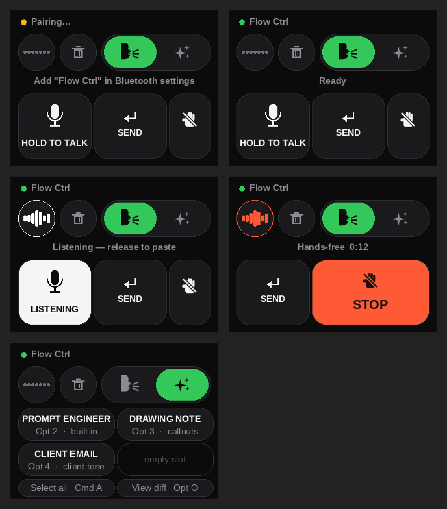

# Firmware & code

## Build it yourself

```
pip install platformio
pio run -e cyd2usb          # USB-C / 2-USB board (ST7789, BGR)
pio run -e cyd              # original micro-USB board (ILI9341)
tools/merge.sh cyd2usb v0.9 # single 0x0 image from the build
```

Build flags (add to `build_flags` or `-D` on the command line):

| Flag | Default | Meaning |
|---|---|---|
| `PTT_MODS` | `(MOD_CTRL\|MOD_OPT)` | modifier bits of your Wispr push-to-talk chord (`MOD_CTRL`, `MOD_SHIFT`, `MOD_OPT`, `MOD_CMD`) |
| `PTT_KEY` | `KEY_T` | the key in the chord (`KEY_T`, `KEY_SPACE`, or any HID usage code) |
| `PANEL_ROTATION` | `1` | `3` flips the landscape image 180° (USB on the other side) |
| `BLE_NAME` | `"Flow Ctrl"` | name shown in Bluetooth settings |
| `DIM_AFTER_MS` | `0` | `0` = always full brightness (the board is USB-powered). Set e.g. `45000` to dim after idle; it never turns off |
| `LED_QUIET` | unset | define to silence the RGB LED |
| `TOUCH_DEBUG` | unset | print raw touch coordinates on serial |

Stack: PlatformIO · espressif32 7.1.3 (Arduino) · LVGL 9.5 · TFT_eSPI · XPT2046_Touchscreen ·
NimBLE-Arduino 2.x. ~103 KB RAM, ~890 KB flash. Compiles clean with no PSRAM.

## The screen

Landscape 320 × 240. The visual cue is Wispr's own listening indicator: a dark circle with a row of
bars that lie flat as dots when idle and breathe while you're talking — white for push-to-talk,
coral when locked into hands-free. The rim of the circle and the RGB LED follow the same state.
Buttons are big because you'll hit them without looking: HOLD TO TALK and SEND are equal at 112 × 100 px,
with a 64 px hands-free key (a slashed-hand icon) on the right. Start hands-free and the row re-flows —
HOLD TO TALK slides off, SEND slides left, and a big coral STOP fills the rest until you tap it. The backlight stays at full brightness — the board is USB-powered,
so there is nothing to save and never a "wake-up" tap.

Colours, radii and fonts are tokens in `src/theme.h`. `tools/mock.py` renders every state with PIL so
you can retune without flashing; `tools/make_guide.py` builds the annotated screens in `docs/`.



## Code map

```
platformio.ini      two envs: cyd (ILI9341) / cyd2usb (ST7789, BGR). Pins from the CYD repo's PINS.md
src/main.cpp        UI (LVGL), touch, state machine, backlight, LED
src/ble_kbd.*       minimal NimBLE HID keyboard: boot-keyboard report map, press / releaseAll / tap
src/theme.h         colour, radius and font tokens
src/assets/         Inter SemiBold 14/16/20 + IBM Plex Mono 14 as LVGL fonts (OFL, licences alongside); ic_*.c icons (head, sparkles, hand)
include/lv_conf.h   LVGL 9.5 configuration
tools/merge.sh      bootloader + partitions + boot_app0 + app → one image at 0x0
tools/make_icons.py PIL-drawn icons → LVGL A8 arrays in src/assets (needs LVGL's LVGLImage.py)
tools/mock.py       PIL mock of the screen states → flow-ctrl-mock.png (copied to docs/screen-states.png)
tools/make_guide.py annotated screens + flow strip for docs/GETTING_STARTED.md
case/               STL + STEP for base, lid, light pipe; print/assembly notes; fastener spec
release/            prebuilt merged image
```

### Notes for anyone adapting it
- The display is driven with a plain TFT_eSPI flush callback and `setRotation(1)`, not LVGL's
  `lv_tft_espi` helper, so landscape needs no software rotation.
- Touch calibration is self-adjusting: the raw min/max grow as you use it, so the corners get
  accurate after a few presses. `TOUCH_DEBUG` shows the raw numbers if a board is far off.
- The HID layer sends modifiers in one report and the key in the next, 12 ms later, like a physical
  keyboard does — some apps ignore a chord that arrives in a single report.
- Any other app with a keyboard shortcut (Superwhisper, MacWhisper, a meeting mute key, a macro)
  can be driven the same way: change `PTT_MODS` / `PTT_KEY`.

